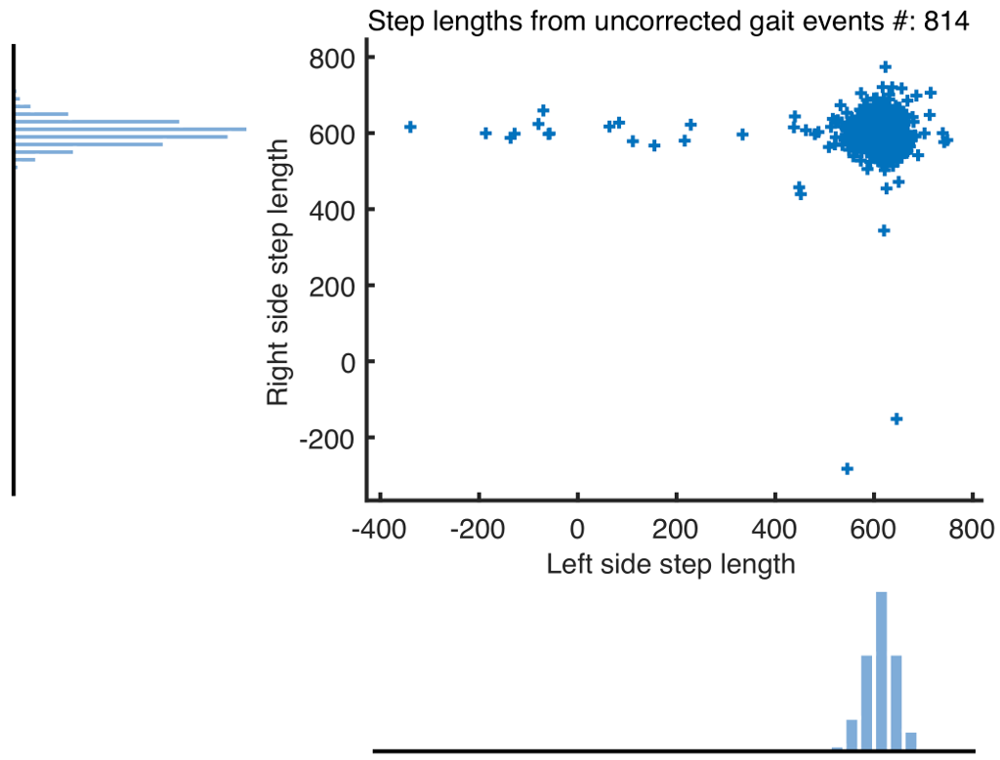
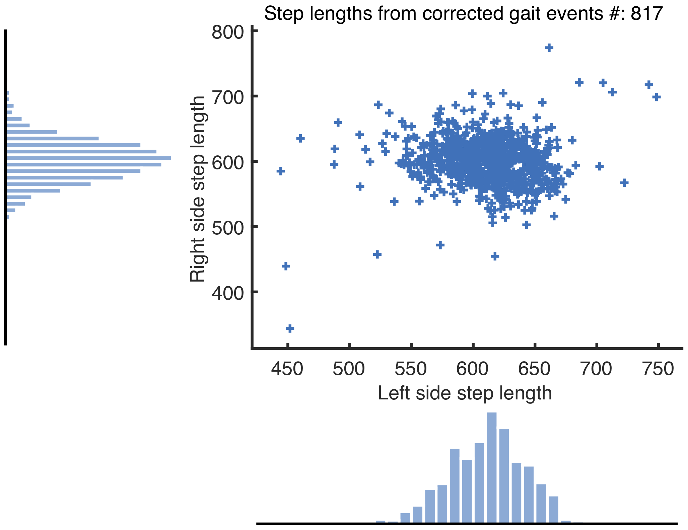

# Gait event anomaly detection and correction during a split-belt treadmill task

DOI for the related publication: Not assigned yet.

## Summary

During instrumented split-belt treadmill tasks it is challenging to avoid partially stepping on the contralateral belt. If this occurs, accurate detection of gait events from force sensors becomes impossible as the force data is invalidated. We present an algorithm which automatically detects these invalid force data using an acceleration derivative based measure.

## Example Data

Two example data files are available in the *Sample Data* folder. 

1. example01_DS.mat: This example contains 15 minutes of  force plate data and 3-D kinematic data from a person walking on a split-belt treadmill in the differential speed configuration (split belts) with a belt speed ratio of 1:2.

1. example01_DS.mat: This example contains 10 minutes of  force plate data and 3-D kinematic data from a person walking on a split-belt treadmill in the same speed configuration (tied belts) with a belt speed ratio of 1:2.

## Running the Example

To run the example, first add knkTools directory and its subfolders to MATLAB's path. Then run the `dacaExample_local.m` script. The results are shown in the below figures.

<em>Fig 1. The step lengths obtained from the uncorrected and the gait events corrected using DACA.</em>

