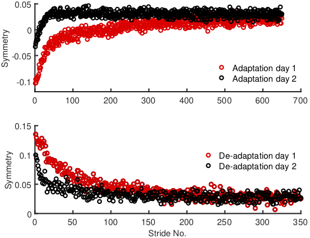
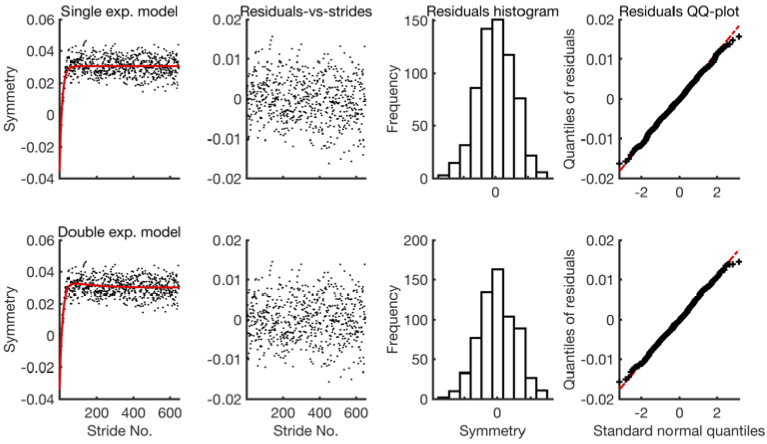

# Fitting Exponential Trends in Step Length Symmetry using Nonlinear Regression

DOI for the related publication: [10.3390/brainscixx010005](https://doi.org/10.3390/brainscixx010005)

## Summary

Single and double exponential models are used to evaluate the time course of adaptation and de-adaptation from step length data in instrumented split-belt treadmill tasks. We propose particle swarm optimisation as a method for model fitting which does not require an initial guess for regression parameters. For model evaluation and comparison, we propose the use of residual plots and Akaike's information criterion (AIC). A method for obtaining confidence intervals which requires a smaller set of assumptions is also suggested.

## Available Functions

1. `fitExpModels`: Fits both the single and double exponential exponential models and presents results for diagnostics. It only requires the symmetry series as input. This function calls the following two worker functions which take multiple inputs and return multiple outputs.

2. `fitSingleExpPSO`: Fits the single exponential model using the particle swarm algorithm.

3. `fitDoubleExpPSO`: Fits the double exponential model using the particle swarm algorithm.

4. `wlCIs`: Estimates the 95% CIs for parameters of the single or double exponential model. CIs based on linearisation and without linearisation assumption are presented.

5. `ycrit`: Takes the model fitted parameters evaluates the overshoot value. The overshoot value corresponds to the critical value of the double exponential function at which its first derivative is 0.

6. `clParameters`: Takes the model fitted parameters and confidence intervals and transforms them into common language parameters and their confidence intervals.

7. `simExpData`: Simulate symmetry series based on parameters of an exponential
%   model (single or double) and a specific residual variance.

## Simulated Example Data

Four simulated symmetry series are provided as examples. These symmetry series are simulated from the parameters of the models fitted to experimental data from two consecutive sessions of split-belt treadmill training. Following series are available in the *./simulatedData/simData.mat* file:

1. groupAdaptationI: Symmetry series simulated from day 1 group-averaged data collected from 15 participants during split-belt treadmill training in the adaptation phase.

2. groupAdaptationII: Symmetry series simulated from day 2 group-averaged data collected from 15 participants during split-belt treadmill training in the adaptation phase.

3. groupDeadaptationI: Symmetry series simulated from day 1 group-averaged data collected from 15 participants during split-belt treadmill training in the de-adaptation phase.

4. groupDeadaptationII: Symmetry series simulated from day 2 group-averaged data collected from 15 participants during split-belt treadmill training in the de-adaptation phase.

<p align="center">
<hr>
<em>Fig 1. Simulated step length symmetry series from adaptation and de-adaptation.</em>
</p>


## Running an Example

With the following code, we fit the exponential models to *groupAdaptationII* series and show the output and plot the results.

```MATLAB
load(fullfile(pwd, 'simulatedData', 'simData.mat'));

fitExpModels(groupAdaptationII);

% ... Optimiser output
% ...
% ...
% Output printed to MATLAB command window:

% Estimates for the single exponential model:
% Name		Estimate	95pc linearised CIs
% a		    -0.0713		-0.0776, -0.0650
% b		    -0.0725		-0.0815, -0.0636
% c		    0.0308		0.0304, 0.0312
%
% Estimates for the double exponential model:
% Name		Estimate	95pc linearised CIs
% a_s		0.0055		0.0000, 0.0111
% b_s		-0.0076		-0.0175, 0.0024
% a_f		-0.0737		-0.0807, -0.0668
% b_f		-0.0618		-0.0735, -0.0501
% c		    0.0300		0.0290, 0.0310
%
%
% Information Criteria:
% AIC for the single exponential model: -2538.048
% AIC for the double exponential model: -2549.661
```

<p align="center">
<hr>
<em>Fig 2. Diagnostic plot from <code>fitExpModels</code> function called to fit exponential models to <b>groupAdaptationII</b> symmetry series.</em>
</p>

## Known Problems

The overall trend (adaptation or de-adaptation) is automatically detected by the fit functions (`fitSingleExpPSO` and `fitDoubleExpPSO`). This is achieved by looking at mean difference of 50 first and last strides. This is not guaranteed to work in all situations. For example, it failed to work 2 out of 30 times in the case of our data. The number of strides can be changed by modifying the following constant in the fit functions:

```MATLAB
>> open fitSingleExpPSO.m

% Change the following constant
%% Constants
NUM_DCSN_STRDS       = 50; % Number of strides used to detect overall trend
```